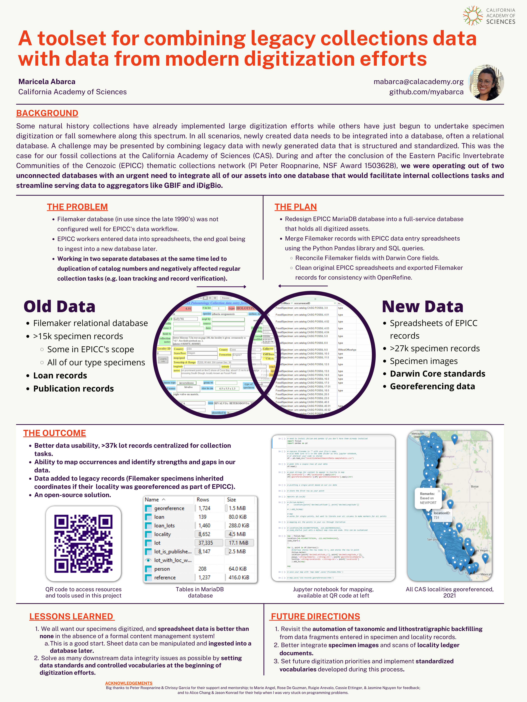

# Combining Legacy Collections Data with Data from Modern Digitization Efforts
 This project began as an attempt to merge collaborative georeference data with their associated collections data. You'll find scripts and documentation for cleaning, combining and mapping georeferenced natural history museum localities and occurrence records. Afterwards, the project focused on integrating our legacy Filemaker database records into a new, open-source MariaDB database. You can find the process and workflow described here as well. You can see an overview of this whole project in the poster presented at the Society for the Preservation of Natural History Collection (SPNHC) 2022 conference. Hopefully this is useful to those of you who are undertaking a similar migration or are trying to combine collections data from different sources to accomplish a task. 
 
 # Contents 
 The [checklist folder](createGeorefChecklist) contains an example for finding localities that still need to be georeferenced. There is a Jupyter notebook and sample csvs for trying a script that creates a new csv with your locationID records that have not yet been georeferenced. It takes all of your locationIDs and compares them to a list of locationIDs that have georeferencing data, and returns where these datasets do not intersect. 
 
 The [map folder](mapGeorefData) has a Jupyter notebook with sample csv for mapping georeferenced data using the Folium Python library. 
 
 The [sql folder](usefulSQLQueries) has some queries useful for joining georeferencing and locality tables in a MySQL/MariaDB database. 
 
 The [database structure folder](databaseStructure) has documentation of the entities and relationships in the MariaDB database. 
 
 The [ingestion workflow folder] has documentation on how duplicate lotIDs were handled before ingesting specimen occurrence records into the final database. 
 
 # Poster Overview
 
